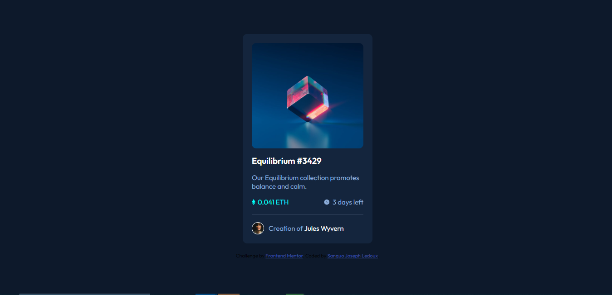

# Frontend Mentor - NFT preview card component solution

This is a solution to the [NFT preview card component challenge on Frontend Mentor](https://www.frontendmentor.io/challenges/nft-preview-card-component-SbdUL_w0U). Frontend Mentor challenges help you improve your coding skills by building realistic projects. 

## Table of contents

- [Overview](#overview)
  - [The challenge](#the-challenge)
  - [Screenshot](#screenshot)
  - [Links](#links)
- [My process](#my-process)
  - [Built with](#built-with)
  - [What I learned](#what-i-learned)
  - [Continued development](#continued-development)
  - [Useful resources](#useful-resources)
- [Author](#author)
- [Acknowledgments](#acknowledgments)

**Note: Delete this note and update the table of contents based on what sections you keep.**

## Overview

### The challenge

Users should be able to:

- View the optimal layout depending on their device's screen size
- See hover states for interactive elements

### Screenshot

### Links

- Solution URL: [Add solution URL here](https://github.com/ledoux25/NFT-PREVIEW-CARD)
- Live Site URL: [Add live site URL here](https://ledoux25.github.io/NFT-PREVIEW-CARD/)

## My process

### Built with

- Semantic HTML5 markup
- CSS custom properties
- Flexbox
- SCSS

### What I learned

I HAVE LEAR THE USE OF flex shrink - grown adn basis wich has icreased my flexbox skills in an exponential way

I learned how to create hover affect by just using th eopacity

### Continued development

I will perfect my use of the SASS framework as it is very useful to structure and fasten my work

### Useful resources

- [Google font](https://www.example.com) - This helped me for the use of the Outfit font throught out the page.

## Author

- Frontend Mentor - [@ledoux25](https://www.frontendmentor.io/profile/ledoux25)
- Twitter - [@SanguoLedo15304](https://https://twitter.com/SanguoLedo15304)

## Acknowledgments
